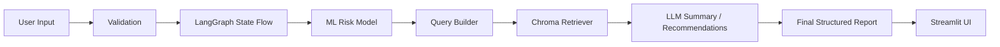

# CardioRisk AI

CardioRisk AI is an Agentic AI Health Support Assistant for cardiovascular-risk support. It preserves the existing logistic-regression risk prediction pipeline and Streamlit user flow, but upgrades the assistant layer to:

- a compiled LangGraph `StateGraph`
- explicit typed shared state
- persisted vector-DB RAG with Chroma
- structured, source-attributed health reports
- graceful fallback behavior for missing data, retrieval gaps, and LLM failures

## Milestone 2 highlights

- LangGraph workflow in `src/agent/workflow.py`
- Typed state schema in `src/agent/state.py`
- Chroma vector-store ingestion and retrieval in `src/agent/retrieval.py`
- Local vector-store build script in `scripts/build_vectorstore.py`
- Updated Streamlit agent UI in `app.py`
- Design notes in `docs/agent_workflow.md`

## What stayed the same

- The existing ML model is still loaded from `models/`.
- `src/inference.py` remains the runtime entry point for risk scoring.
- The patient-input flow in Streamlit remains form-based and local-run friendly.
- Existing training/evaluation artifacts are preserved.

## Architecture overview



## LangGraph workflow

The workflow is compiled before execution and uses shared typed state across every node.

Primary nodes:

1. `validate_input`
2. `normalize_input`
3. `score_risk`
4. `extract_risk_factors`
5. `retrieve_guidelines`
6. `generate_summary`
7. `generate_recommendations`
8. `validate_output`
9. `handle_fallback`

Branching behavior:

- Missing or invalid required patient fields route to `handle_fallback`, not a crash.
- ML scoring failures route to `handle_fallback`.
- Retrieval failures or zero-hit retrieval continue with a safe constrained response.
- LLM failures fall back to deterministic report rendering.

## Vector-DB RAG

The markdown knowledge base under `knowledge_base/` is ingested into a local persisted Chroma store:

- Persist directory: `data/vectorstore/chroma_db`
- Chunk metadata:
  - `source_file`
  - `document_title`
  - `section_heading`
  - `chunk_id`

At runtime:

- If the persisted vector store exists, the app loads it.
- If it does not exist, the app builds it automatically.
- You can also rebuild it explicitly with the provided script.

## Repository structure

```text
GenAI-capstone/
├── app.py
├── train.py
├── requirements.txt
├── README.md
├── docs/
│   └── agent_workflow.md
├── scripts/
│   └── build_vectorstore.py
├── data/
│   ├── raw/
│   ├── processed/
│   └── vectorstore/
├── knowledge_base/
├── models/
├── src/
│   ├── data_processing.py
│   ├── evaluation.py
│   ├── features.py
│   ├── inference.py
│   ├── utils.py
│   └── agent/
│       ├── config.py
│       ├── embeddings.py
│       ├── prompts.py
│       ├── retrieval.py
│       ├── state.py
│       └── workflow.py
└── tests/
    ├── test_agent_config.py
    ├── test_inference.py
    ├── test_retrieval.py
    └── test_workflow.py
```

## Input specification

The app expects the same patient fields used by the ML model:

- `age`
- `systolic_bp`
- `cholesterol`
- `max_heart_rate`
- `bmi`
- `sex`
- `chest_pain`
- `smoker`
- `diabetes`
- `exercise_angina`

Optional agent focus input:

- free-text clinical focus or follow-up question

## Output specification

The assistant returns:

- risk tier
- probability
- key factors
- retrieved sources
- structured report with:
  - `Risk Summary`
  - `Key Factors`
  - `Recommendations`
  - `Follow-up Suggestions`
  - `Sources`
  - `Disclaimer`
- workflow trace
- fallback / partial-output status when relevant

## Setup

Python: `3.11+`

Install dependencies:

```bash
pip install -r requirements.txt
```

Install development/test dependencies:

```bash
pip install -r requirements-dev.txt
```

Optional but recommended if you use a virtual environment:

```bash
python3 -m venv .venv
source .venv/bin/activate
pip install -r requirements-dev.txt
```

## Train or refresh the ML artifacts

If the saved model artifacts are missing, regenerate them with:

```bash
python3 train.py
```

## Build or rebuild the vector DB

Manual rebuild:

```bash
python3 scripts/build_vectorstore.py
```

The app will also auto-build the Chroma store on first use if it is missing.

## Run the app locally

```bash
streamlit run app.py
```

Legacy compatibility entry point:

```bash
streamlit run dashboard/app.py
```

## Tests

Run the test suite with:

```bash
pip install -r requirements-dev.txt
pytest
```

## Environment variables

Required:

- None for deterministic local mode

Optional:

- `GEMINI_API_KEY`
- `CARDIO_AGENT_MODEL`
- `APP_ENV`

If `GEMINI_API_KEY` is absent, the assistant still runs in deterministic grounded mode.

## Local run commands

Typical end-to-end local workflow:

```bash
pip install -r requirements.txt
python3 train.py
python3 scripts/build_vectorstore.py
streamlit run app.py
```

## Hallucination control

- Prompting forbids invented diagnoses and fabricated guideline claims.
- Recommendations are constrained to patient input, ML output, and retrieved chunks.
- Source attribution is always surfaced.
- The disclaimer is always present.
- Missing-data uncertainty is stated explicitly.
- Invalid or malformed LLM output is discarded in favor of deterministic rendering.

## Design doc

See `docs/agent_workflow.md` for:

- state schema
- node responsibilities
- branching logic
- failure handling
- hallucination-reduction strategy
